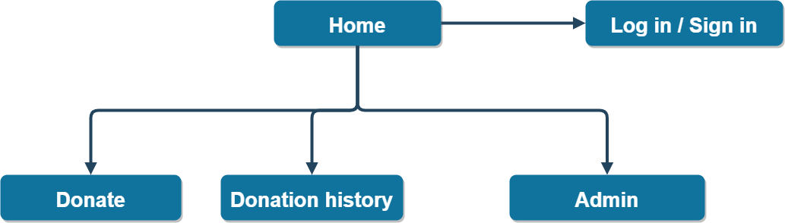

<h1 align="center"> Donate Me
</h1>

# Table of Contents

* [Links](#Links)
* [Purpose](#Purpose)
* [Functionality and Features](#Functionality-and-Features)
* [Sitemap](#Sitemap)
* [Entity relations](#Entity-relations)
* [Screenshots](#Screenshots)
* [Target audience](#Target-audience)
* [Tech stack](#Tech-stack)
   

# Links

Deployed website : 

GitHub repository :  https://github.com/jasonkim7288/rails_donate_me_via_paypal

[Go back](#table-of-contents)   

# Purpose

'Donate me' is a website for users to donate me via paypal so that they can invest for my future. Paypal transation is test mode, so don't worry about the money you will donate.

[Go back](#table-of-contents)   

# Functionality and Features

This website is fully responisve from mobile to desktop, and makes users experience how donation makes them feel good.

### Main menu

[Go back](#table-of-contents)   

# Sitemap

[Go back](#table-of-contents)   

# Entity relations

[Go back](#table-of-contents)   

# Screenshots
### Planning layouts
for phone (iPhone 8 plus)

![Wireframe for iPhon 8 plus]

for tablet (iPad pro)

![Wireframe for iPad pro]

for desktop

![Wireframe for]

### Screenshots

[Go back](#table-of-contents)   

# Target audience

[Go back](#table-of-contents)   

# Tech stack

- Rails : Main structure and content
- Postgresql : Database
- CSS : Styling, animations & responsiveness
- Github : Source control
- Draw.io : Sitemap
- Figma : Wireframe

[Go back](#table-of-contents)   
